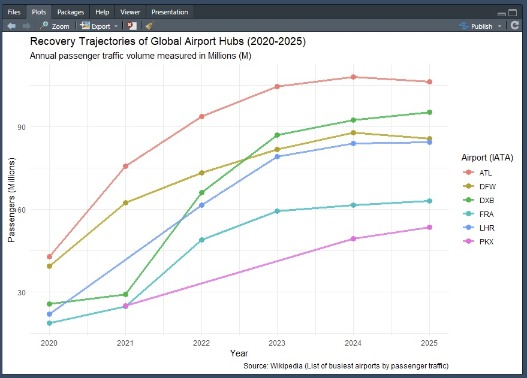

# Aviation Traffic Analysis
 
A data pipeline and visualization project analyzing the post-pandemic passenger traffic recovery of six major global airport hubs between 2020 and 2025.
 
Data is scraped directly from Wikipedia, tidied, and visualized to surface diverging recovery patterns across domestic-heavy and international-heavy airports.
 
---
 
## Output
 

 
---
 
## 🗂️ Repo Organization
 
```
Aviation Traffic Analysis/
├── 01-DataPrep.R
├── 02-Tidying.R
├── 03-Plotting.R
└── Airports-Recovery-Trajectories.jpg
```
 
---
 
## Pipeline Overview
 
The analysis is split across three sequential scripts:
 
**`01-DataPrep.R`** : Table generation  
Reshapes the tidy dataset into a wide-format summary table using `gt`, formatted for readability with passenger volumes in Millions (M), ranked by 2025 traffic.
 
**`02-Tidying.R`** : Scraping & wrangling  
Scrapes annual passenger traffic tables from [Wikipedia](https://en.wikipedia.org/wiki/List_of_busiest_airports_by_passenger_traffic) using `rvest`, standardizes column names across years, extracts IATA codes, and binds data for 2020–2025 into a single tidy dataframe.
 
**`03-Plotting.R`** : Visualization  
Builds the recovery trajectory line chart using `ggplot2`, scaling passengers to Millions and plotting annual totals per airport with a minimal theme.
 
---
 
##  Airports Analyzed
 
| IATA | Airport |
|------|---------|
| ATL | Hartsfield–Jackson Atlanta International |
| DFW | Dallas/Fort Worth International |
| DXB | Dubai International |
| FRA | Frankfurt Airport |
| LHR | Heathrow Airport (London) |
| PKX | Beijing Daxing International |
 
---
 
##  Dependencies
 
```r
library(tidyverse)
library(rvest)
library(ggplot2)
library(gt)
```
 
---
 
## 🔍 Key Finding
 
ATL maintained dominant traffic volume throughout the recovery period, reflecting the resilience of domestic-heavy hubs. International-heavy airports like DXB and LHR showed sharper 2020–2021 declines but accelerated recovery by 2023, illustrating a clear **"two-speed" recovery pattern** driven by the pace of international travel reopening.
 
---
 
*Data source: [Wikipedia — List of busiest airports by passenger traffic](https://en.wikipedia.org/wiki/List_of_busiest_airports_by_passenger_traffic)*
