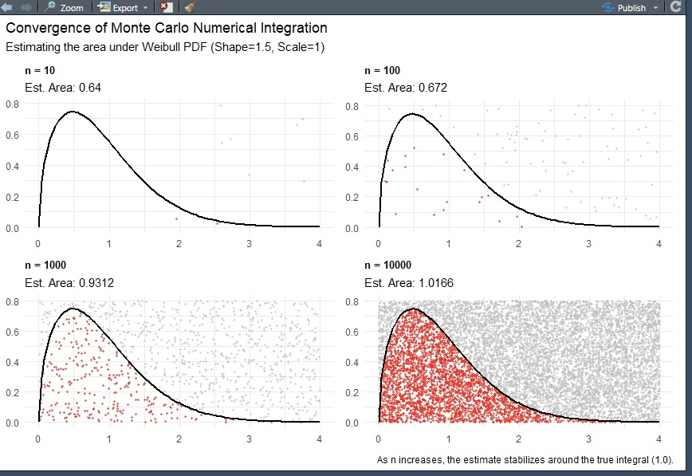

# Monte Carlo Numerical Integration
 
A stochastic simulation project demonstrating Monte Carlo integration for estimating the area under a **Weibull probability density function. The project builds a modular, documented function library and visualizes how estimation precision improves as sample size grows.
 
---
 
##  Output
 

 
> As `n` increases, the estimated area converges toward the true integral (1.0).
 
---
 
##  Repo Organization
 
```
Monte Carlo Simulation/
├── 01-Intro.R
├── 02-Wrangling-&-Plot.R
├── 03-Final-Visualization.R
└── Convergence-of-MC-Integration.jpg
```
 
---
 
##  Pipeline Overview
 
**`01-Intro.R`** — Core simulation function  
Defines `generate_mc_simulation()`, a Roxygen2-documented function that generates `n` random `(x, y)` coordinate pairs uniformly sampled within a specified bounding rectangle. This is the reusable engine that powers the entire simulation.
 
**`02-Wrangling-&-Plot.R`** — Single-run wrangling & prototype plot  
Runs the simulation at `n = 1000`, classifies each point as a hit (`Below/On` the Weibull curve) or miss (`Above`), and computes the MC estimate as:
 
$$\hat{I} = A_{\text{rect}} \times \frac{\text{hits}}{n} = 3.2 \times \hat{p}$$
 
Produces a single labeled scatter plot overlaid with the Weibull PDF for visual validation.
 
**`03-Final-Visualization.R`** — Small-multiple convergence layout  
Defines `make_mc_plot()` as a helper to run the full pipeline at any resolution. Runs four simulations at `n = 10, 100, 1000, 10000` and combines them into a single small-multiple layout using `patchwork`, illustrating algorithmic convergence.
 
---
 
##  Method
 
Monte Carlo integration estimates a definite integral by random sampling within a bounding rectangle:
 
1. Sample `n` random points uniformly from the rectangle `[x_min, x_max] × [y_min, y_max]`
2. Classify each point: **hit** if `y ≤ f(x)`, **miss** otherwise
3. Estimate the integral: `Î = rect_area × (hits / n)`
The target function is the **Weibull PDF** with Shape=1.5, Scale=1, whose true integral over `[0, ∞)` is 1.0 — used as the ground truth for convergence validation.
 
---
 
##  Dependencies
 
```r
library(devtools)
library(tidyverse)
library(ggplot2)
library(patchwork)
```
 
---
 
##  Key Finding
 
At low resolutions (`n = 10, 100`), estimates are noisy and unreliable. By `n = 10000`, the estimate stabilizes tightly around **1.0**, confirming convergence and demonstrating the law of large numbers in action.
 
